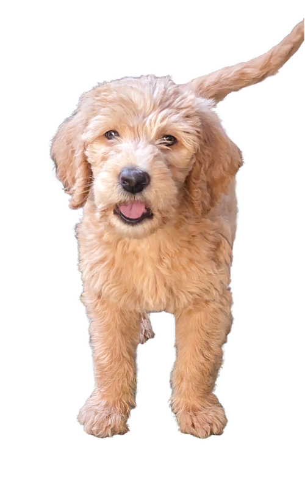
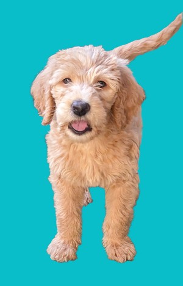
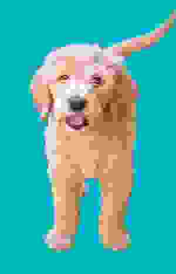
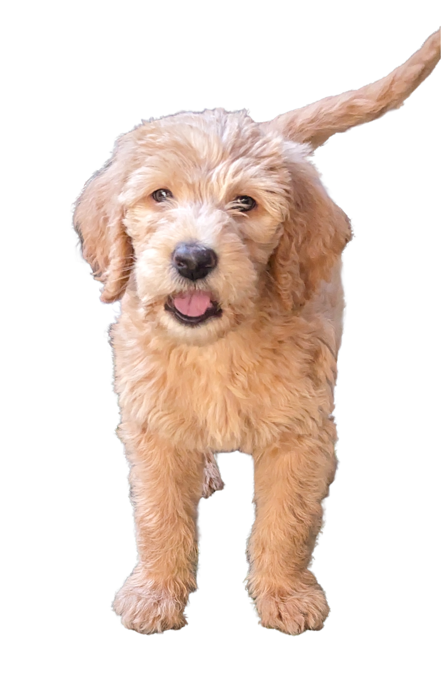
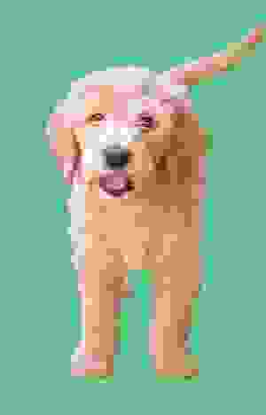
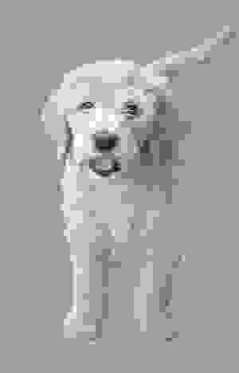
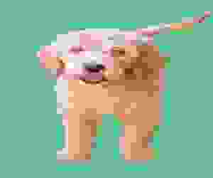

# Cloud Image Transform

This tool will fetch, re-process, and display images from the web. It uses Google Cloud Function for image manipulation.

### Quick Example usage
`<your-GCP-func-url.com>/<your-endpoint>?url=<external-image-url>&w=300&gs=1&fmt=png`

Original Image: https://storage.googleapis.com/misc-shared-images-public/rita-pup.png

Example using `?url=https://storage.googleapis.com/misc-shared-images-public/rita-pup.png&w=300&bg=rgb(9,189,201)&fmt=jpeg&qlt=1`
  <table>
  <tr>
    <td align="center">
      <strong>Resize</strong><br>
      
    </td>
    <td align="center">
      <strong>Set Background Color</strong><br>
      
    </td>
    <td align="center">
      <strong>Reduce File Size</strong><br>
      
    </td>
  </tr>
</table>
  

Parameters:
 - `url`:  url of image to ingest. eg. `?url=https://site.io/image.png`
 - `w`: width in pixels. Applying just width will auto scale height. eg. `&w=300`
 - `h`: height in pixels. Applying just height will auto scale width. eg. `&h=150`
 - `fmt`: outputs image format in jpeg, png, or webp only. Default is png. eg. `&fmt=jpeg`
 - `qlt`: for jpeg and webp, decreases the image quality and file size. Default is 90. eg. `&qlt=10`
 - `gs`: boolean for grayscale. eg. `&gs=1`
 - `bg`: to set transparency background color. eg. `&bg=rgb(9,189,201)`
 - `rotate`: Pick from 90, 180, and 270. eg. `&rotate=180`
 - `apikey`: Check incoming request for validation. eg `&apikey=<api-key-you-create>`
 
## Components

1.  **Image Processing Google Cloud Function (`image_processor_func/main.py`)**:
    *   Fetches an image from a given URL.
    *   Optionally resizes the image to specified dimensions.
    *   Optionally rotates the image.
    *   Optionally converts the image to grayscale.
    *   Optionally applies a background color, RGB.
    *   Optionally reduces quality of JPEGs and WEBPs.
    *   Returns a PNG, JPEG, or WEBP.
    *   The entry point for the function is [`process_image_for_transformation`](image_processor_func/main.py).


1.  **Local Development Server (`local_dev.py`)**:
    *   A Flask application that allows local testing of the image processing logic found in [`image_processor_func.main.process_image_for_transformation`](image_processor_func/main.py).

## Setup and Usage

### Python Environment

The project uses Conda for environment management. You can create and activate the environment using the [environment.yml](environment.yml) file:
  ```bash
    conda env create -f environment.yml
    conda activate cloud-image-transform
  ```

### Google Cloud Function
- Deployment: The Google Cloud Function can be deployed using the deploy script:
  ```bash
  chmod +x deploy.sh
  ./deploy.sh 
  ```

- Dependencies: Python dependencies for the cloud function are listed in `requirements.txt`

### Local Development
To test the image processing function locally, run the Flask development server:
```bash
python local_dev.py
```

### Additional Examples

#### Resize Image

  <details>
  <summary> Original Image </summary>
    
  </details>

  <details>
  <summary> Resized Image <code> &w=300</code>
  </summary>
    
  </details>

  <details>
  <summary> Add Background and reduce quality/file size  <code> &bg=rgb(99,200,140)&quality=1(</code></summary>
    
  </details>

  <details>
  <summary> Make grayscale <code> &gs=1</code></summary>
    
  </details>

  <details>
  <summary> Rotate!  <code> &rotate=90 &rotate=180 &rotate=270</code>
  </summary>
    
  </details>

  <details>
  <summary> Setting width and height can distort the image  <code> &w=300&h=250</code></summary>
    
  </details>